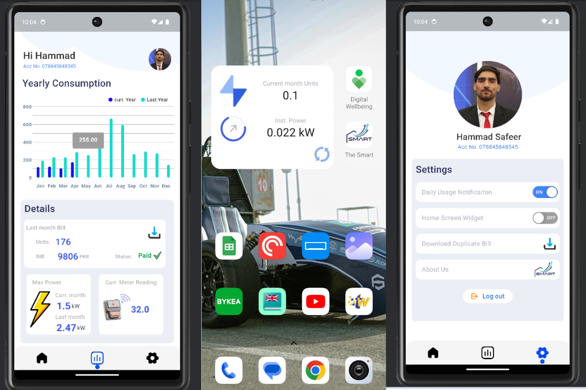

# LoRaWAN SmartMeter App

## Overview

The **LoRaWAN-SmartMeter-App** is Flutter based app for custom LoRaWAN smart meters, fetching real-time power data from The Things Network via API. It offers consumption insights, predictive billing, downloadable reports, and energy usage monitoring to help users manage consumption effectively.

---

## Features

- **Real-Time Data Visualization**
  - View instantaneous power, current meter readings, and maximum power usage.
  - Home screen widgets displaying units consumed and instantaneous power stats.

- **Historical Data Analysis**
  - Daily, weekly, monthly, and yearly power consumption graphs.
  - Downloadable reports of last month's bill and current month bill.

- **Predictive Analytics**
  - Compute expected bill and units using a regression algorithm based on current month's usage.

- **User Account Management**
  - Secure authentication using Firebase.
  - Persistent login sessions unless the user chooses to log out.
  - Personalization of app settings and preferences.

- **Notifications**
  - Enable daily consumption notifications to stay updated on power usage.

- **Billing Information**
  - View current month's bill status (paid or unpaid).
  - Access to last bill details and download options.

- **Integration with The Things Network**
  - Seamless communication with smart meter devices via LoRaWAN technology.
  - Data retrieval through The Things Network API.

- **Availability**
  - The app is available on the [Google Play Store](https://play.google.com/store/apps/details?id=com.smartmetering.app) for easy access.

---

## Screenshots (  [Want to Download From Playstore?](https://play.google.com/store/apps/details?id=com.smartmetering.app))

---

## Getting Started

### Prerequisites

- **Flutter SDK**: [Install Flutter](https://flutter.dev/docs/get-started/install) on your development machine.
- **Firebase Account**: Set up a [Firebase](https://firebase.google.com/) project for authentication and data storage.
- **The Things Network Account**: Access to [The Things Network](https://www.thethingsnetwork.org/) for API integration.
- **Android/iOS Device or Emulator**: To run and test the application.

---

## Architecture

The app follows a **Model-View-Controller (MVC)** architecture, ensuring a clear separation of concerns:

- **Model**: Represents the data layer, including user data, power consumption records, and billing information.
- **View**: The UI components built using Flutter widgets, providing a responsive and interactive user interface.
- **Controller**: Handles the business logic, including API calls to The Things Network, data processing, and communication between the Model and View.

---

## Technologies Used

- **Flutter**: For cross-platform mobile app development.
- **Firebase**: For authentication and cloud storage.
- **LoRaWAN Technology**: For wireless communication with smart meter devices.
- **The Things Network API**: To access data from deployed devices.
- **Regression Algorithms**: For predictive analytics on power consumption and billing.
- **Figma**: For UI/UX design (Design files available upon request).

---
## Design Conception

## Figma Design

Here is the link to Figma design Workspace:  [Figma design](https://www.figma.com/design/zj2X6oGE4MRHwRgvGyZYpa/Smart-Meter-App?node-id=0-1&t=KTJB96XEowiixOpz-1)
---

## License

This project is licensed under the MIT License - see the [LICENSE](LICENSE) file for details.

---

## Contact

For any inquiries or feedback, please contact:

- **Name**: Hammad Safeer
- **LinkedIn**: [Your LinkedIn Profile](https://www.linkedin.com/in/hammad-safeer42/)
- **GitHub**: [Your GitHub Profile](https://github.com/Hammad-Safeer42)

---

If you liked the repo then kindly support it by giving it a star ⭐!

Copyright (c) 2024 HAMMAD SAFEER
